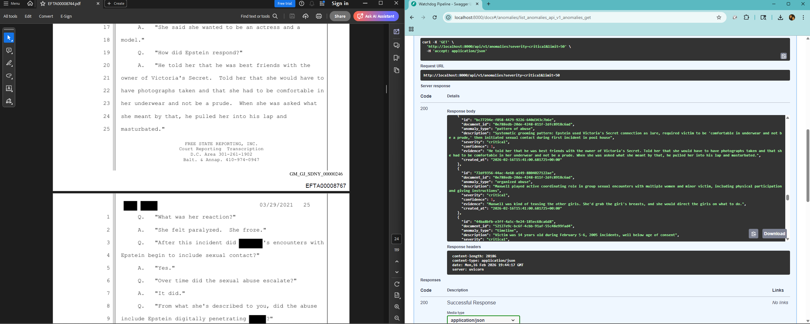
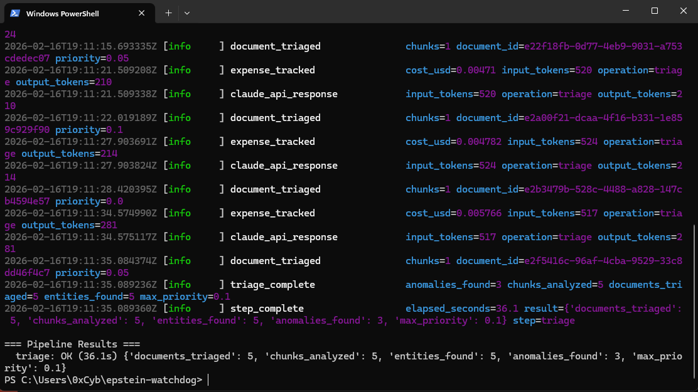
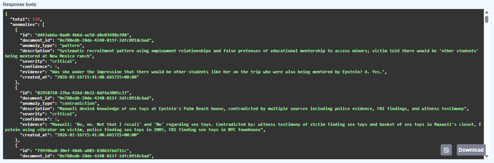
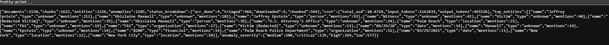

# watchdog-pipeline

Automated document analysis pipeline that ingests, OCRs, chunks, embeds, and triages large document dumps — surfacing the needles in the haystack.

Built and battle-tested on the Epstein court documents: **960+ DOJ docs triaged, 2,226 entities extracted, 1,185 anomalies flagged.**



---

## Architecture

```
PDF/Images → OCR → Chunking → Embedding → LLM Triage
                                  ↓              ↓
                              pgvector      Anomaly scores
                                  ↓         + priority ranking
                              Semantic      + explanations
                               search             ↓
                                  └────────────────┘
                                     REST API (FastAPI)
```

## Quick Start

```bash
# Clone and install
git clone https://github.com/0xCybin/watchdog-pipeline.git
cd watchdog-pipeline
uv sync

# Set up services (Postgres + pgvector, Redis)
docker compose up -d

# Configure
cp .env.example .env
# Edit .env with your Anthropic API key and document path

# Run database migrations
uv run alembic upgrade head

# Run the pipeline
uv run watchdog-pipeline --step all --limit 50
```

## Pipeline Steps

| Step | What it does |
|------|-------------|
| **download** | Ingests documents from a local archive or remote source into the database |
| **ocr** | Extracts text from PDFs/images using PyMuPDF + Tesseract fallback |
| **chunk** | Splits documents into token-counted chunks with page tracking |
| **embed** | Generates sentence-transformer embeddings, stored in pgvector |
| **triage** | LLM-driven anomaly detection — scores and explains what's suspicious |



## API Endpoints

| Method | Endpoint | Description |
|--------|----------|-------------|
| `GET` | `/health` | Health check |
| `GET` | `/api/v1/documents` | List documents (filter by status, sort by priority) |
| `GET` | `/api/v1/documents/{id}` | Document detail with chunks |
| `GET` | `/api/v1/anomalies` | List flagged anomalies |
| `GET` | `/api/v1/entities` | Extracted entities |
| `GET` | `/api/v1/stats` | Pipeline statistics |
| `GET` | `/api/v1/search` | Semantic search across chunks |
| `POST` | `/api/v1/pipeline/run` | Trigger pipeline run via API |





Start the API server:

```bash
uv run uvicorn watchdog.api.app:create_app --factory --reload
```

## Use Cases

- **FOIA/court document analysis** — the original use case. Process thousands of released documents and surface anomalies.
- **Corporate compliance** — ingest contract dumps, flag unusual clauses or missing signatures.
- **Research corpus processing** — OCR and chunk academic papers, search semantically across them.
- **Journalism** — process leaked or released documents, prioritize what to read first.
- **Legal discovery** — triage large document sets by relevance and anomaly score.

## Tech Stack

- **Python 3.11+** with async throughout
- **FastAPI** — REST API
- **PostgreSQL + pgvector** — storage and semantic search
- **Redis** — caching
- **Anthropic API** — LLM triage
- **sentence-transformers** — embeddings
- **PyMuPDF + Tesseract** — OCR

## Contributing

1. Fork the repo
2. Create a feature branch (`git checkout -b feature/my-feature`)
3. Make your changes
4. Run tests: `uv run pytest`
5. Open a PR

## License

MIT — see [LICENSE](LICENSE).
